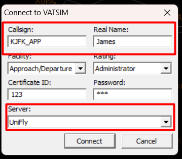
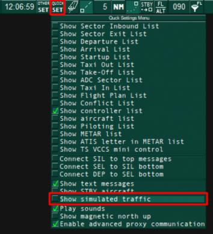
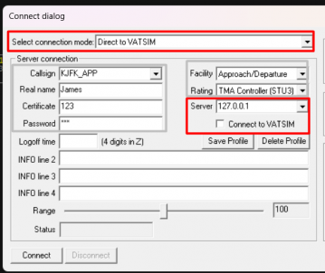

# Connecting as ATC

UniFly ATC provides an adapter between our network and popular Air Traffic Control software EuroScope and VRC. This guide demonstrates how to connect UniFly to these software.

Unlike older versions of the ATC Adapter, the adapter is now entirely included within the unifly client executable - there is no seperate download for the ATC adapter.

The adapter works by creating a local network server to which EuroScope and VRC listen in to. As such, it is necessary to configure EuroScope and VRC to connect to this local server rather than to VATSIM.

We do not offer assistance with the installation and setup of sector files within your chosen ATC client. Please consult your ATC client's own documentation for this.

## Setting up for VRC

To setup the UniFly server in VRC, follow these steps:
1. Inside of `Documents/VRC` you will find a file named `myservers.txt`. (If this file does not already exist, create a new one with the same name)
2. Open it up with Notepad. On a new line at the bottom write `127.0.0.1 UniFly`

Now, whenever you want to connect, follow these steps:

1. Start VRC and navigate to `File -> Connect`. Populate the window as normal with your callsign and name.
2. You must fill the certificate ID and password inputs with random numbers. If you leave them empty it will not allow you to connect
3. At the bottom, select UniFly for the server. Do not connect to Vatsim. If you don't see UniFly as an option, go back to the setup stage.
4. Now, inside the UniFly Client press connect. It will detect that VRC is open and start up the adapter server on your local network. You must connect on the UniFly Client BEFORE you connect on VRC
7. Now, go back to VRC and Connect

## Setting up for EuroScope

1. Start the UniFly Client and press connect. It will detect that EuroScope is open and start up the adapter server on your local network. You must press connect on UniFly Client BEFORE you connect on Euroscope
2. Open EuroScope
3. Make sure `Show Simulated Traffic` is disabled in Euroscope under the `Quick SET` menu

4. Open the Connection dialogue with the `Connect` button in the top left of EuroScope
5. Set `Select connection mode` to `Direct to Vatsim` (Don't worry, we're not connecting to Vatsim)
6. Set `Server` to `127.0.0.1`. (Although this field looks like a dropdown box, it will allow you to type into it.)
7. Beneath `Server`, untick the `Connect to VATSIM` checkbox
8. You must fill the certificate ID and password inputs with random numbers. If you leave them empty it will not allow you to connect
9. Populate the remaining details and press Connect

# Caveats
- Flightplans are inserted into the ATC client's every 20 seconds. This unfortunately means that any modifications you make to a pilots flightplan inside the ATC software will be overwritten every 20 seconds.
- UniFly does not yet support Squawk codes